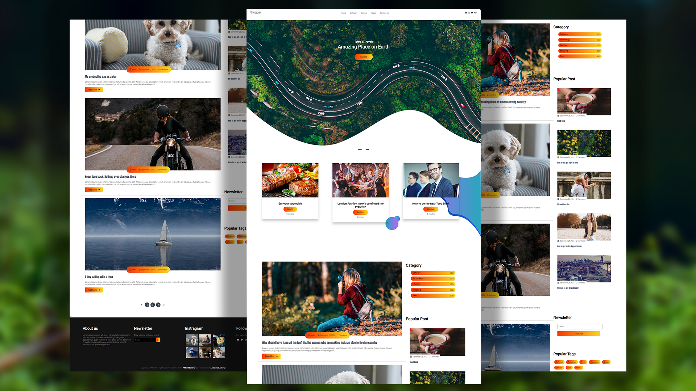

# Responsive Blog Website
## Demo
👉Website demo: https://mitzelldone.github.io/Responsive_Blog_Website/Index.html

## Technology
- [FontAwesome version 5.15.4](https://fontawesome.com/)
- [Webgradient](https://webgradients.com/)
- [AOS](https://michalsnik.github.io/aos/)
- [owl.carousel.js](https://owlcarousel2.github.io/OwlCarousel2/index.html)
## Feature
- Mobile Compatibility
- Contact Info
- Social Media Icons
- Navigation Bar
- Navigation Toggle
- Contains animations when scrolling.
- Developed with the Web methodology first, then for mobile.
- Compatible with all mobile devices and with a beautiful and pleasant user interface.
## Credit
- Thanks to [Akshay Kashyap](https://github.com/akashyap2013). 
- His Youtube channel [Daily Tuition](https://www.youtube.com/channel/UCrG2Z0usOCCdUTAr4D1A8mw).
- Complete Responsive Blooger Website Using HTML/CSS: [Tutorial Video](https://youtu.be/CrSC1ZA9j0M)
